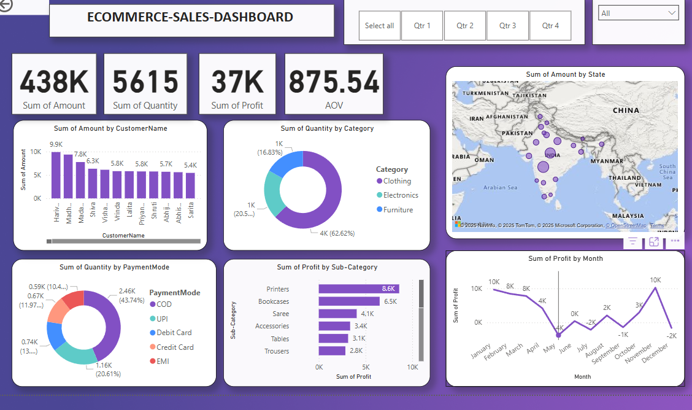

# 🛍️ E-Commerce Sales Dashboard (Power BI)

This is an interactive Power BI dashboard created to analyze sales, profit, quantity, and customer trends from e-commerce data. It merges and visualizes data from two sources to provide meaningful insights for business decisions.

---

## 📁 Files Included

- `ecommerce_dashboard.pbix` – Main Power BI dashboard file
- `details.csv` – Contains order details like Amount, Profit, Quantity, Category, etc.
- `orders.csv` – Contains Order Date, Customer Name, State, City
- One screenshot of the dashboard

---

## 📊 Dashboard Features

### ✅ KPIs Displayed:
- Total Sales
- Total Profit
- Quantity Sold
- Average Order Value (AOV)

### 📈 Visuals:
- Sales by Category and Sub-Category
- Sales by State and City
- Profit Trends
- Payment Mode Analysis
- Customer Performance
- Time-based trends (Monthly, Quarterly)

---

## 📷 Dashboard Screenshot

> ⚠️ Make sure your screenshot is named `dashboard_overview.png` or update the name here to match your uploaded file.

---

## 🛠 Tools Used

- Power BI Desktop
- Power Query Editor
- DAX Measures for KPIs

---

## 🚀 How to Use

1. Clone the repository or download the `.pbix` file.
2. Open in **Power BI Desktop**.
3. Explore the dashboard and visuals interactively.
